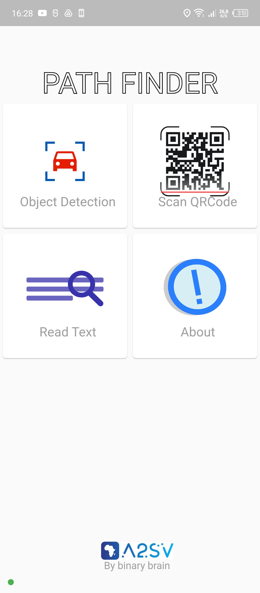

# PathFinder Application

```PathFinder is an app that helps visually impaired people to navigate through the world. It uses object detection to detect objects in the environment and then uses text to speech to tell the user what is in front of them. It also uses a camera to detect the user's surroundings and then uses text to speech to tell the user what is in front of them. It also uses a camera to detect the user's surroundings and then uses text to speech to tell the user what is in front of them.```

⸐⸏⸏⸏⸏⸏⸏⸏⸏⸏⸏⸏⸏⸏⸏⸏⸏⸏⸏⸏⸏⸏⸏⸏⸏⸏⸏⸏⸏⸏⸏⸑
> [!NOTE]
> ✏This Application is made for hackaton of African 2 Sillicon Valley[(A2SV)](https://hacks.a2sv.org/)

.svg)
⸐⸏⸏⸏⸏⸏⸏⸏⸏⸏⸏⸏⸏⸏⸏⸏⸏⸏⸏⸏⸏⸏⸏⸏⸏⸏⸏⸏⸏⸏⸏⸑

## ➠Main functionality
- Obstacle detection and identification  : Using the phone's camera we can detect any obstacle in front of you and identify it with precision
- Optical Character Recognition (OCR) : Our application can recognize text and perform reading. thanks to the voice assistant, the user will have the text content through a voice message
- Whatsapp SOS Alert : This module allows the visually impaired person to send an alert message by WhatsApp to the number of a close person. Just by moving his phone he will be able to send the alert. the alert sends a message including the precise location of the visually impaired person, the time it sent the alert and other information...
- Timekeeping  : With this module, the person using the application can know the correct time with a voice command
- Climate detection : Using this application you can know the weather 
- QR Code Scanning :  PATHFINDER can scan a QR code following a voice command and read the textual content written in

⸐⸏⸏⸏⸏⸏⸏⸏⸏⸏⸏⸏⸏⸏⸏⸏⸏⸏⸏⸏⸏⸏⸏⸏⸏⸏⸏⸏⸏⸏⸏⸑

## ➠Useful Command
- detect, detection, launch detection: Fort Start detection Object
- scan, what is in front of me, what is this: To let voice assistant to speak what he detect
- read, launch read, lire: to launch OCR
- what is write, reading, can you read, lecture: to let voice assistant to speak what he can read
- back, return, retour, home: to return in the main screen
- about, à propos, what is this application,tell about path finder: to let voice assistance to speak about pathfinder
- tell me time, what's time, quelle heure, time: to let voice assistance to speak about current time
- qr code: to scan a qr code
- weather, what's weather: to let voice assistance to speak about current weather
- ***Shaking phone***: sending SOS message 


⸐⸏⸏⸏⸏⸏⸏⸏⸏⸏⸏⸏⸏⸏⸏⸏⸏⸏⸏⸏⸏⸏⸏⸏⸏⸏⸏⸏⸏⸏⸏⸑
## ➠Technology used
###  🔰[Flutter](https://flutter.dev/)
Flutter allowed us to develop the mobile application to allow users to interact.

version used: 
Flutter version 3.13.8
###  🔰[TensorFlow](https://www.tensorflow.org/)
Tensorflow allowed us to have a model for image classification
###  🔰[Teachable Machine](https://teachablemachine.withgoogle.com/)
Tensorflow allowed us to train our model
###  🔰[Kaggle](https://kaggle.com)
Kaggle allowed us to collection dataset of object
###  🔰[Nodejs](https://nodejs.org/)
Nodejs allowed us to use some api like send whatsapp message(SOS functionality)

version used: 
Nodejs version 20
###  🔰[Baileys](https://whiskeysockets.github.io/Baileys/)
whiskeysockets Baileys allowed us to use whatsapp methode like send message
⸐⸏⸏⸏⸏⸏⸏⸏⸏⸏⸏⸏⸏⸏⸏⸏⸏⸏⸏⸏⸏⸏⸏⸏⸏⸏⸏⸏⸏⸏⸏⸑

## Authors

- [@ezechielSums](https://www.github.com/Sums-shadow)
- [@mardocheLuviki](https://github.com/Mardoxhee)
- [@gogoSokombe](https://github.com/sokombe)
